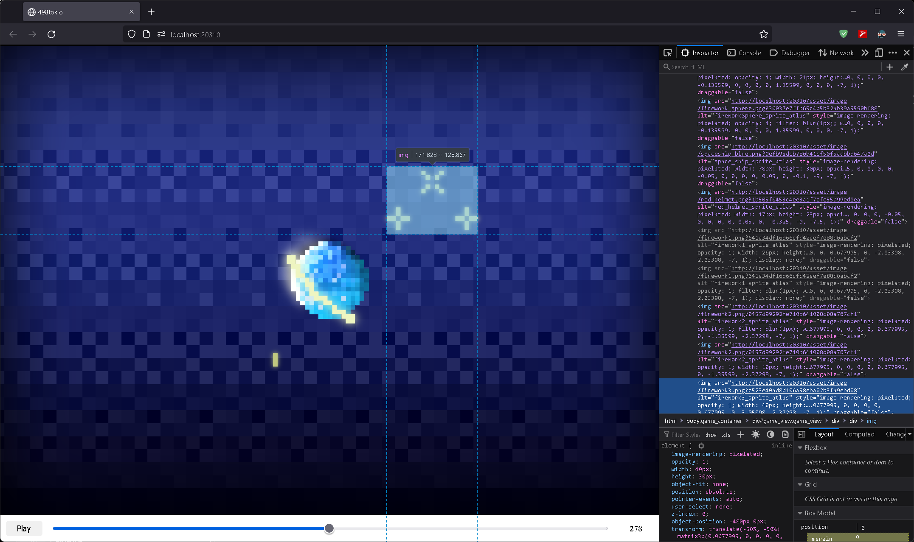

# tw-engine-498tokio

implementation of a keyframe animation for web game.

## about
- keyframe animation with audio sync
- use typescript for web
- this implementation can be used anywhere (not dependent on the game engine)

## preview

All animations in this project are rendered in CSS (do not use WebGL)

### [build](build/index.html)